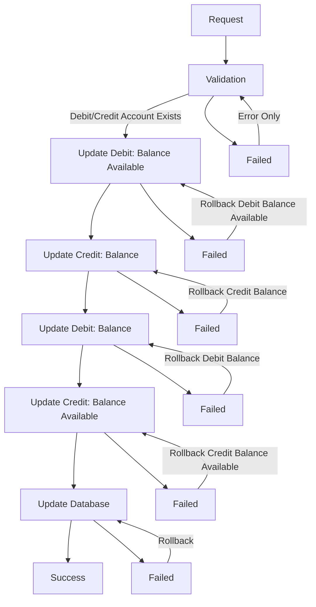

# SagaBank

## Same bank
```json
{
    "amount": 10,
    "debitaccountid": 0,
    "creditaccountid": 1
}
```

### Graph


## Different bank
```json
{
    "amount": 10,
    "debit": {
        "bank": "debco",
        "accountid": 0
    },
    "credit": {
        "bank": "credco",
        "accountid": 1
    }
}
```
