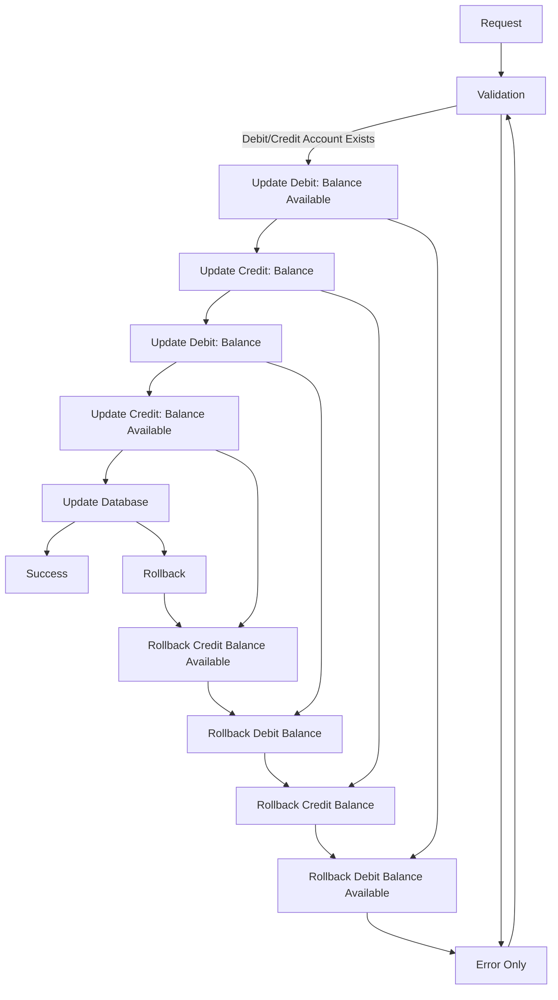

# SagaBank

## Notes

* See also: [Saga Orchestration Serverless](https://github.com/Azure-Samples/saga-orchestration-serverless) for the Azure implementation

## Same bank
```json
{
    "amount": 10,
    "debitaccountid": 0,
    "creditaccountid": 1
}
```

### Graph


